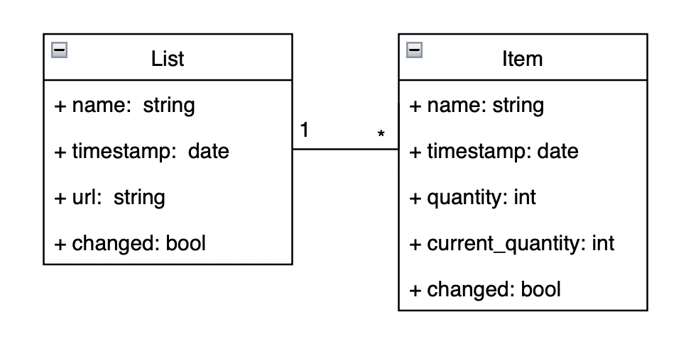

# Design Choices

## Topics

- [1. Technology](#1-technology)
- [2. Local First](#2-local-first)
    - [2.1 Client Request Management](#21-client-request-management)
    - [2.2 Fault tolerance](#22-fault-tolerance)
    - [2.3 Cloud connection](#23-cloud-connection)
- [3. Cloud](#3-cloud)
    - [3.1 Client Request Management](#31-client-request-management)
    - [3.2 Fault tolerance](#32-fault-tolerance)
    - [3.3 Replication between nodes](#33-replication-between-nodes)
- [4. CRDT](#4-crdt)
- [5. References](#5-references)
- [6. Members](#6-members)

## 1. Technology

Selected client-side technologies prioritize simplicity and user-friendliness, emphasizing a seamless experience, particularly in web applications where ease of installation and use is crucial. The chosen technologies are:

- `Node.js`, for client and server side applications;
- `SQLite3`, for database management system;

This ensures the project runs seamlessly with straightforward commands:

```bash
$ node client.js <PORT>     # client
$ node proxy.js             # proxy
$ node server.js <PORT>     # server
```

Furthermore, selected technologies and libraries will be employed for the implementation of distributed system connections, cloud infrastructure management, and the maintenance of integrity and consistency:

- `ZeroMQ`, for high-performance asynchronous messaging;
- `UUID`, for the generation of unique identifiers across the entire system;
- `Async Mutex`, to inhibit issues of concurrency between threads;

## 2. Local First

The primary focus initially is to attain a `Local First` [1] behavior. To achieve this, persisting data from recognized lists is crucial. In the initial phase, the web application checks for the existence of a local database:

- If present, loads its content (lists and items);
- If absent, creates an empty database following the predefined schema presented in [Figure 1];


Figure 1: Database schema

Note that the boolean attribute changed is crucial for identifying, in adverse conditions, which lists or items have been modified by the client but are not yet in the cloud backup. 

To enable the sharing of shopping lists between users, two requirements must be met simultaneously when they are created:

- The list must be instantiated locally, following the Local First approach;
- The URL must be unique throughout the system and serve as the identifier for that specific list;

If the URL construction relies on the list name and/or creation timestamp, conflicts may arise in the system. To address this concern, a potential implementation is based on `UUIDs`[2]. UUIDs (Universally Unique Identifiers) are globally unique identifiers that ensure uniqueness throughout the system. In our case, we will opt to use version 4 UUIDs, which provide a high probability of uniqueness as they are based on random data. This makes them suitable for generating unique URLs in a distributed system where nodes cannot communicate initially.


<p align=center>Figure 2: Local First Approach</p>

As depicted in [Figure 2], the client web application will have three essential tasks: client request management, fault tolerance, and cloud connection. For improved management and isolation of each action, `Worker Threads` with `Mutex` will be utilized. Since they will be manipulating the same data structure (a CRDT [3], to be further explored), it is necessary to ensure concurrency control and inhibit potential errors and inconsistency.

### 2.1 Client Request Management

This includes handling user inputs, processing requests promptly, and ensuring a responsive interaction with the application.

### 2.2 Fault tolerance

The web application will periodically store the volatile manipulated information in the local database file. This way, even if there is an error in the application or connectivity issues, most, if not all, of the user's changes will be saved, including those that have not yet been backed up to the cloud.

### 2.3 Cloud connection

In general, the previously described approach will ensure the proper functioning of the web application even without a connection to the cloud, thus limiting the ability to back up or transfer information. To address this, the application will periodically attempt to establish a connection with the cloud for the following purposes:

- Updating local information based on what is received from the cloud;
- Sending modified local information to the cloud to propagate it throughout the system.

## 3. Cloud

Clients will connect to the same proxy. This will enable:

- An end-to-end system without the user being aware of the cloud implementation, including details such as the number of available servers or their corresponding addresses;
- Elimination of the need for a fixed connection between the client and server or a fixed number of servers always available;

The implemented proxy serves an additional crucial function: load balancing [N], which prevents performance loss or bottlenecks in exhaustive requests to a single server, thereby enhancing the overall system efficiency. This load balancing can be achieved using the ZeroMQ library [N], with ROUTER-REQ connections in both the frontend (client-proxy connection) and the backend (proxy-server connection). However, it is important to note that the proxy becomes a potential point of failure in the system.


<p align=center>Figure 3: Proxy as load balancer</p>

The core of the solution lies in the strategic management and distribution of data. The proposals for replication and sharding are directly informed by the architecture of Amazon Dynamo [N], providing a concrete and proven strategy for achieving scalability and resilience.

As stated in [Figure 4], the server-side application will also have three threads, with proper concurrency control, to perform essential tasks: client request management, fault tolerance, and replication.

### 3.1 Client Request Management


### 3.2 Fault tolerance

Just like on the client side, there is a need for each node/server to have its own database. Therefore, the server side web application will periodically store the volatile manipulated information in the local database file.

### 3.3 Replication between nodes


## 4. CRDT

Intro. TODO.

## 5. References

- [Local First](https://www.inkandswitch.com/local-first/)
- [ZeroMQ.js](https://github.com/zeromq/zeromq.js#examples)
- [UUID in JS](https://www.npmjs.com/package/uuid)
- [Worker Threads](https://nodejs.org/api/worker_threads.html)
- [Load Balancer](https://zguide.zeromq.org/docs/chapter3/#The-Load-Balancing-Pattern)
- [Amazon Dynamo](https://www.allthingsdistributed.com/files/amazon-dynamo-sosp2007.pdf)
- [Gossip-Based Node Discovery]()

## 6. Members

- André Costa, up201905916@up.pt
- Bárbara Carvalho, up202004695@up.pt
- Fábio Sá, up202007658@up.pt
- Luís Cabral, up202006464@up.pt

#### T05, SDLE 2023/24