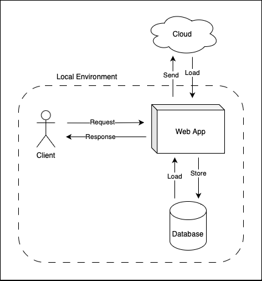

# Design Choices

## Topics

- [Technology](#technology)
- [Local First](#local-first)
    - [Main design]()
    - [Database]()
    - [Fault Tolerance]()
- [Cloud]()
    - [CRDT]()
    - [Sharding]()
- [References]()

## Technology

We have selected the technologies for our project with a strong focus on simplicity and user-friendliness. Our goal is to create a seamless experience for our users, particularly in web applications, where ease of installation and use is paramount. Therefore, the technologies used were: 

- `Node.js` for client and server side applications;
- `SQLite3` for database management system;
- `ZeroMQ.js` for connections, messaging and messaging serialization;

This way, our project can be run with simple commands:

```bash
$ node client.js <PORT>                         # client
$ node proxy.js <PORT_CLIENTS> <PORT_SERVERS>   # proxy
$ node server.js <PORT>                         # server
```

## Local First


<p align=center>Figure 1: Local First Approach</p>

A prioridade inicial é conseguir um comportamento local first da aplicação. Para isso é importante persistir os dados das listas conhecidas. Numa primeira fase, a web application vai verificar se existe uma base de dados local:

- se existir, faz load do seu conteúdo;
- se não existir, cria uma com base no [schema](#schema) pré-estabelecido;

Todas as interações seguintes do utilizador com a aplicação serão controladas pela thread principal. Periodicamente fará também um store da informação manipulada no ficheiro local. Deste modo mesmo que aconteça algum erro as maior parte das alterações do utilizador ficará guardada (**fault tolerance**).

### Database

#### Schema

Database schema.

#### ACID 

Controlo de concorrência. Locks or transactions.

### Fault Tolerance

Para prevenir, a web application fará periodicamente um store da informação manipulada no ficheiro local. Deste modo mesmo que aconteça algum erro as maior parte das alterações do utilizador ficará guardada.

## Cloud

## References

- [Local First](https://www.inkandswitch.com/local-first/)
- [ZeroMQ.js](https://github.com/zeromq/zeromq.js#examples)
- []()

## Members


https://app.diagrams.net/?title=SDLE&client=1#G1agWQFztshaIb5v3dHwP1MBTlk_1rd5jp