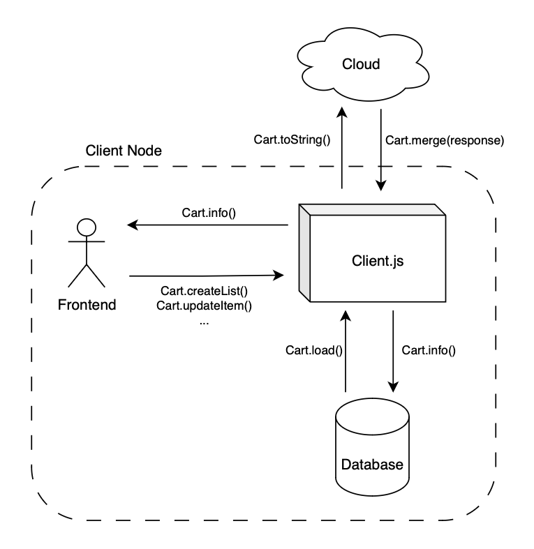

# Design Choices

## Topics

- [Technology](#technology)
- [Local First](#local-first)
    - [Database](#database)
        - [Schema](#schema)
        - [ACID](#acid)
    - 
- [Cloud](#cloud)
    - [CRDT]()
    - [Sharding]()
- [Fault Tolerance](#fault-tolerance)
    - [Client Side](#client-side)
    - [Server Side](#server-side)
- [References](#references)

## Technology

We have selected the technologies for our project with a strong focus on simplicity and user-friendliness. Our goal is to create a seamless experience for our users, particularly in web applications, where ease of installation and use is paramount. Therefore, the technologies used were: 

- `Node.js` for client and server side applications;
- `SQLite3` for database management system;
- `ZeroMQ.js` for high-performance asynchronous messaging;

This way, our project can be run with simple commands:

```bash
$ node client.js <PORT>     # client
$ node proxy.js             # proxy
$ node server.js <PORT>     # server
```

## Local First


<p align=center>Figure 1: Local First Approach</p>

A prioridade inicial é conseguir um comportamento local first da aplicação. Para isso é importante persistir os dados das listas conhecidas. Numa primeira fase, a web application vai verificar se existe uma base de dados local:

- se existir, faz load do seu conteúdo;
- se não existir, cria uma com base no [schema](#schema) pré-estabelecido;

Todas as interações seguintes do utilizador com a aplicação serão controladas pela thread principal. Esta thread também é responsável pela [client side fault tolerance](#client-side).

O utilizador poderá 

Para haver 

### Database


#### Schema

Database schema.

#### ACID 

Controlo de concorrência. Locks or transactions.


## Cloud

Intro. TODO.

## Fault Tolerance

### Client Side

Para prevenir, a web application fará periodicamente um store da informação manipulada no ficheiro local. Deste modo mesmo que aconteça algum erro na aplicação ou conexões a maior parte das alterações do utilizador ou até mesmo todas ficarão guardadas.

### Server Side


## References

- [Local First](https://www.inkandswitch.com/local-first/)
- [ZeroMQ.js](https://github.com/zeromq/zeromq.js#examples)
- [Diagrams](https://app.diagrams.net/?title=SDLE&client=1#G1agWQFztshaIb5v3dHwP1MBTlk_1rd5jp)

## Members

- André Costa 
- Bárbara Rodrigues
- Fábio Sá
- Litago