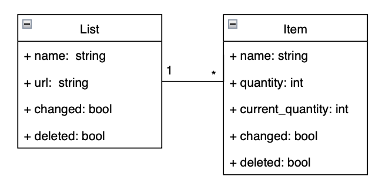
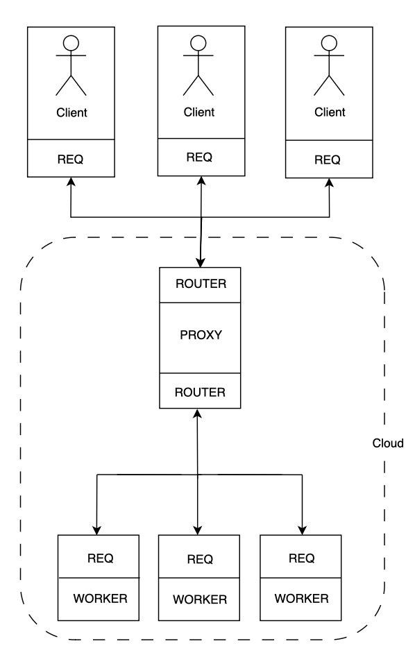
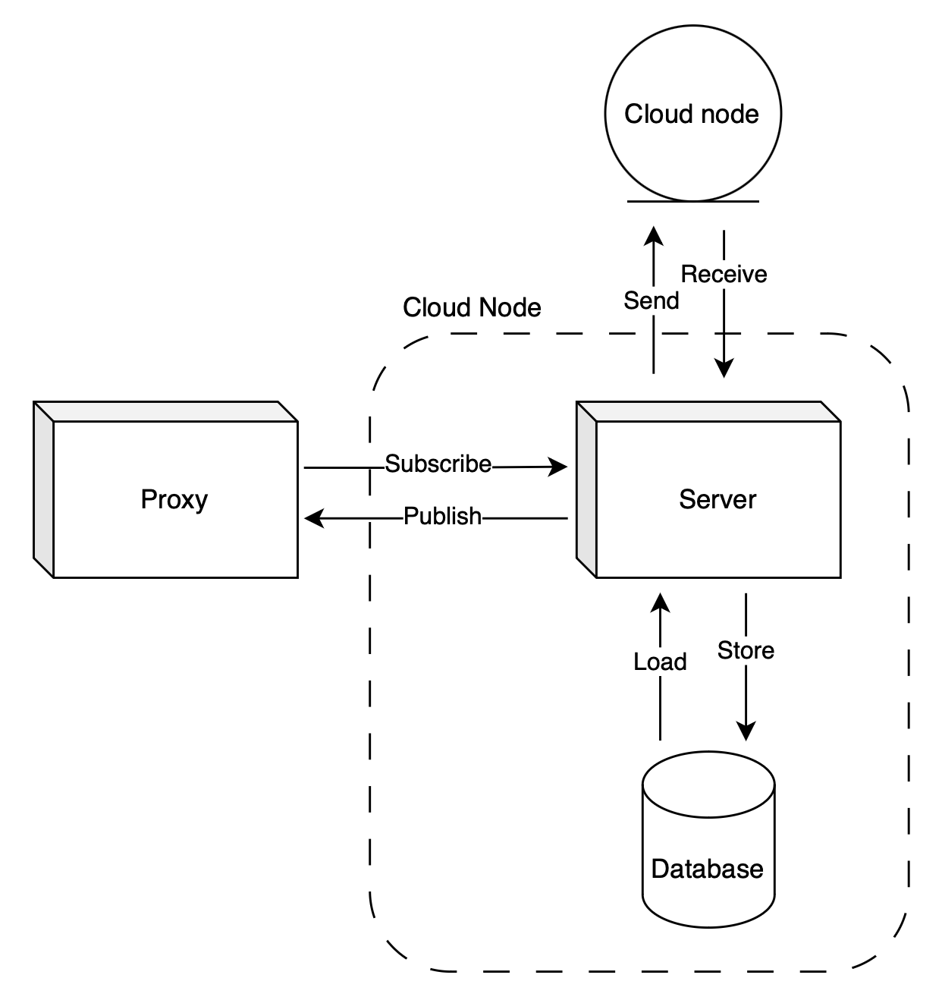
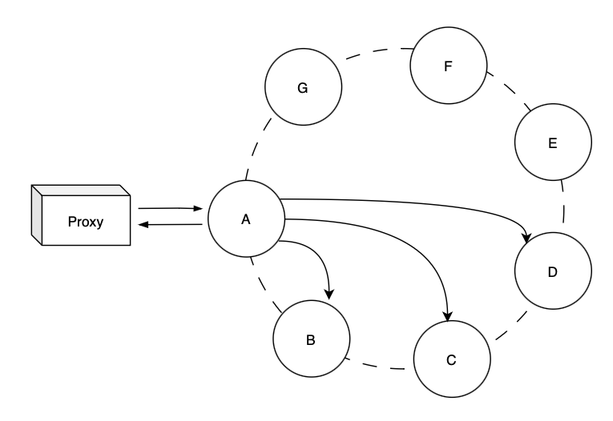

# Report - Presentation

## Topics

- [0. Context and Overview](#0-context-and-overview)
- [1. Technology](#1-technology)
- [2. Local First](#2-local-first)
    - [2.1 Client Request Management](#21-client-request-management)
    - [2.2 Fault tolerance](#22-fault-tolerance)
    - [2.3 Cloud connection](#23-cloud-connection)
- [3. Cloud](#3-cloud)
    - [3.1 Client Request Management](#31-client-request-management)
    - [3.2 Fault tolerance](#32-fault-tolerance)
    - [3.3 Replication between nodes](#33-replication-between-nodes)
- [4. CRDT](#4-crdt)
- [5. References](#5-references)
- [6. Members](#6-members)

## 0. Context and overview

- `Local-First Design`: prioritizes a local-first approach, running code on user devices for data persistence. This ensures offline functionality, enhancing user experience by allowing them to access and modify their shopping lists without an internet connection.

- `Collaborative Lists`: each shopping list has a unique ID, facilitating collaboration. Users with the list ID can seamlessly collaborate, enabling them to collectively manage and update shopping lists.

## 1. Technology

We opted for user-friendly web application, prioritizing simplicity in technology choices for easy installation and use.

- `Node.js`, for client and server side applications;
- `SQLite3`, for local database management system;

Additionally, for distributed system connections, cloud management, and maintaining integrity and consistency:

- `ZeroMQ`, for high-performance asynchronous messaging;
- `UUID`, for the generation of unique identifiers across the entire system;

## 1. Cart API

Each node in the distributed system instantiates and manipulates a "Cart" object that gathers CRUD (Create, Read, Update, Delete) functions and data consistency features.

```js
const cart = new Cart(<node-id>);
cart.load(db);

const url = cart.createList('List A');
cart.deleteItem(url, 'Apple');
cart.updateItem(url, 'Soup', 6, 7);

cart.info()     // get information for frontend
cart.toString() // serialize object for messaging and merge

// syncronization
cart1.merge(cart2.toString())
cart2.merge(cart1.toString())
```

### Advantages:

- Functional for any node in the system (client or server);
- Encapsulates complex operations and algorithms for data consistency (CRDTs);
- It is the only variable that nodes have to manipulate, simplifying concurrency control.

### Implementation

- Cart contains a Map between the URL of each list and an AWORSet, enabling constant-time data retrieval for a list, O(1);
- AWORSet (*Add Wins Observed Remove Set*), a State-Based CRDT, keeps track of all causal contexts of the list but only retains in memory the items that have not been removed, improving spatial performance;
- GCounter (*Grow-only Counter*) is employed to manipulate the total and partial quantities of each item;

```js
class Cart {
  this.lists = new Map();   // Map<url, AWORSet>
}

class AWORSet {
  this.set = []             // [(itemName, GCounter, (nodeID, version))]
  this.causalContext = []   // [(nodeID, version)]
}

class GCounter {
  this.currentValue = 0;
  this.totalValue = 0;
}
```

## 2. Local First

The persistence of data from recognized lists becomes crucial. In the initial phase, the client app checks for the presence of a local database:

- If present, loads its content, lists and corresponding items;
- If absent, creates an empty database following the predefined schema;

<p align="center">
  
  <p align="center">Figure 1: Database Schema</p>
</p><br>

-> Repare-se que só donos podem eliminar o seu próprio

To enable the secure sharing of shopping lists between users, two requirements should be concurrently met upon their creation:

- The list must be instantiated locally, following the Local First approach;
- The generated URL must be unique throughout the system and serve as the identifier for that specific list;

If the URL construction relies on the list name and/or creation timestamp, conflicts may arise in the system. To address this concern, the current implementation is based on `UUIDs`[8]. UUIDs (*Universally Unique Identifiers*) are globally unique identifiers that ensure uniqueness throughout the system. 
In this scenario, version 4 of UUIDs is selected, which provide a high probability of uniqueness as they are based on random data. This makes them suitable for generating unique URLs in a distributed system where nodes cannot communicate initially.

<p align="center">
  
  <p align="center">Figure 2: Local First approach</p>
</p><br>

As depicted in [Figure 2], the client web application has three essential tasks: client request management, fault tolerance, and cloud connection. For improved management and isolation of each action, `Worker Threads` with `Mutex` were utilized. Since they will be manipulating the same data structure (a CRDT [2], to be further explored), it is necessary to ensure concurrency control and inhibit potential errors and inconsistency.

### 2.1 Client Request Management

This includes handling user inputs, processing requests promptly, and ensuring a responsive interaction with the application.

### 2.2 Fault tolerance

The web application periodically stores the volatile manipulated information in the local database file. This way, even if there is an error in the application or connectivity issues, most, if not all, of the user's changes will be saved, including those that have not yet been backed up to the cloud.

### 2.3 Cloud connection

The previously described approach will ensure the proper functioning of the web application even without a connection to the cloud. To manage data cloud backup, the client-side periodically attempts to establish a connection with the cloud for the following purposes:

- Sending modified local information to the cloud to propagate it throughout the system;
- Updating local information based on what is received from the cloud;

## 3. Cloud

In this cloud-based system, clients exclusively connect to a central proxy server. This architecture offers several key advantages:

- An end-to-end system without the user being aware of the cloud implementation, including details such as the number of available servers or their corresponding addresses;
- Elimination of the need for a fixed connection between the client and server or a fixed number of servers always available;

The implemented proxy server serves a critical additional function: load balancing [4]. Load balancing is essential to prevent performance degradation or bottlenecks when handling extensive requests on a single server, ultimately enhancing the efficiency of the entire system. For load balancing, the ZeroMQ library is employed, utilizing ROUTER-REQ connections in both the frontend (client-proxy connection) and the backend (proxy-server connection).

<p align="center">
  
  <p align="center">Figure 3: Proxy as Load Balancer</p>
</p><br>

The core of the solution lies in the strategic management and distribution of data. The proposals for replication and sharding are directly informed by the architecture of Amazon Dynamo [1], providing a concrete and proven strategy for achieving scalability and resilience.

<p align="center">
  
  <p align="center">Figure 4: Cloud Node</p>
</p><br>

As stated in [Figure 4], the server-side application has three threads as well, with proper concurrency control, to perform essential tasks: client request management, fault tolerance, and replication.

### 3.1 Client Request Management

When the proxy redirects requests to the server, the server is responsible for adjusting its internal Conflict-free Replicated Data Type (CRDT) [2] based on client updates. The response to the request will be another CRDT whose content reflects the current state of the system for the lists known to the client.

### 3.2 Fault tolerance

Just like on the client-side, there is a need for each node/server to have its own database. Therefore, the server-side web application periodically stores the volatile manipulated information in the local database file.

### 3.3 Replication between nodes

To ensure eventual consistency across the entire system, the replication of modified data between servers is crucial. Upon instantiation, servers gain access to a list of neighboring servers. The order of each server's list enables the construction of a dependency network in the form of a ring, as illustrated in [Figure 5].

<p align="center">
  
  <p align="center">Figure 5: Replication ring</p>
</p><br>

When a node detects a modification in its internal CRDT, it proceeds to communicate and propagate this alteration to the N neighboring nodes, following the specified order. The propagation involves a merge between the CRDTs of the two parties. In terms of connection fault tolerance, if a server among the chosen N servers does not respond, it is skipped, and communication is redirected to another remaining server.

An interruption or failure of a node does not signify a permanent exit from the ring; therefore, it should not result in the rebalancing of the assignment of these partitions.

## 4. CRDT

CRDTs (*Conflict-free Replicated Data Types*) are utilized for message exchange both between client-server and among server nodes. These data types offer a distinctive approach to addressing consistency in distributed systems, enabling automatic convergence of replicated data, even in the presence of concurrent operations and asynchronous communication between nodes.

Given that each user should be able to instantiate and delete lists, as well as instantiate and delete items within each list, implementing CRDT for these data structures based on `ORMap` (*Observed Remove Map*) and `Enable Wins` was a prudent choice. Indeed, considering the project's context, concurrent deletions and updates of a list or item should promote the persistence of that structure in the system, thereby avoiding information loss.

To increment the quantity purchased for each item, the `GCounter CRDT` was the suitable choice as it efficiently handles concurrent increments.

All operations performed on these Delta-enabled CRDTs [3] are idempotent, ensuring the convergence of the current system state and eventual consistency.

## 5. References

- [1] - [Amazon Dynamo](https://www.allthingsdistributed.com/files/amazon-dynamo-sosp2007.pdf)
- [2] - [CRDT](https://crdt.tech/papers.html)
- [3] - [Delta enabled CRDTs](https://github.com/CBaquero/delta-enabled-crdts)
- [4] - [Load Balancer](https://zguide.zeromq.org/docs/chapter3/#The-Load-Balancing-Pattern)
- [5] - [Local First](https://www.inkandswitch.com/local-first/)
- [6] - [UUID in JS](https://www.npmjs.com/package/uuid)
- [7] - [Worker Threads](https://nodejs.org/api/worker_threads.html)
- [8] - [ZeroMQ.js](https://github.com/zeromq/zeromq.js#examples)

## 6. Members

- André Costa, up201905916@up.pt
- Bárbara Carvalho, up202004695@up.pt
- Fábio Sá, up202007658@up.pt
- Luís Cabral, up202006464@up.pt

#### T05, SDLE 2023/24