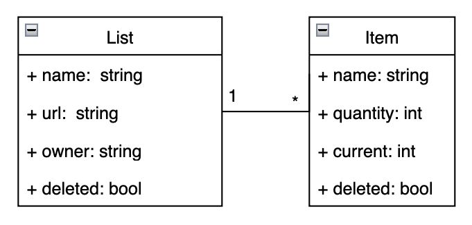
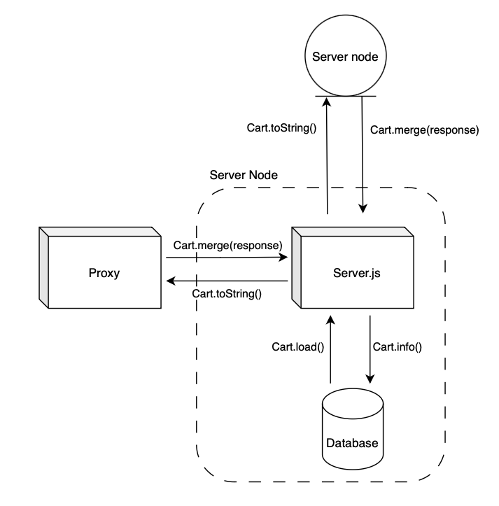

# Report - Presentation

- André Costa, up201905916@up.pt
- Bárbara Carvalho, up202004695@up.pt
- Fábio Sá, up202007658@up.pt
- Luís Cabral, up202006464@up.pt

---

## Index

- [0. Context and Overview](#0-context-and-overview)
- [1. Technology](#1-technology)
- [2. Cart API](#2-cart-api) 
- [3. Local First](#3-local-first)
- [4. Cloud](#4-cloud)
    - [4.1 Replication between nodes](#41-replication-between-nodes)
- [5. References](#5-references)

---

## 0. Context and overview

- `Local-First Design`: prioritizes a local-first approach, running code on user devices for data persistence. This ensures offline functionality, enhancing user experience by allowing them to access and modify their shopping lists without an internet connection.

- `Collaborative Lists`: each shopping list has a unique ID, facilitating collaboration. Users with the list ID can seamlessly collaborate, enabling them to collectively manage and update shopping lists.

---

## 1. Technology

We opted for user-friendly web application, prioritizing simplicity in technology choices for easy installation and use.

- `Node.js`, for client and server side applications;
- `SQLite3`, for local database management system;

Additionally, for distributed system connections, cloud management, and maintaining integrity and consistency:

- `ZeroMQ`, for high-performance asynchronous messaging;
- `UUID`, for the generation of unique identifiers across the entire system;

---

## 2. Cart API

Each node in the distributed system instantiates and manipulates a "Cart" object that gathers CRUD (Create, Read, Update, Delete) functions and data consistency features.

```js
const cart = new Cart(<node-id>);
cart.load(db);

const url = cart.createList('List A');
cart.deleteItem(url, 'Apple');
cart.updateItem(url, 'Soup', 6, 7);

cart.info()     // get information for frontend
cart.toString() // serialize object for messaging and merge

// syncronization
cart1.merge(cart2.toString())
cart2.merge(cart1.toString())
```

### Advantages:

- Functional for any node in the system (client or server);
- Encapsulates complex operations and algorithms for data consistency (CRDTs);
- It is the only variable that nodes have to manipulate, simplifying concurrency control.

---

### Implementation

- Cart contains a Map between the URL of each list and an AWORSet, enabling constant-time data retrieval for a list, O(1);
- AWORSet (*Add Wins Observed Remove Set*), a State-Based CRDT, keeps track of all causal contexts of the list but only retains in memory the items that have not been removed, improving spatial performance;
- GCounter (*Grow-only Counter*) manipulates the total and partial quantities of each item;

```js
class Cart {
  this.lists = new Map();   // Map<url, AWORSet>
}

class AWORSet {
  this.set = []             // [(itemName, GCounter, (nodeID, version))]
  this.causalContext = []   // [(nodeID, version)]
}

class GCounter {
  this.currentValue = 0;
  this.totalValue = 0;
}
```

---

## 3. Local First

- In the initial phase, the client app checks for the presence of a local database following the predefined schema;

<p align="center">
  
  <p align="center">Figure 1: Database Schema</p>
</p><br>

- The URL is instantiated locally using UUID v4:
  - global uniqueness
  - it does not rely on any user input, which may not be unique throughout the system
  - is independent of timestamps, which can be desynchronized between nodes

--- 

<p align="center">
  
  <p align="center">Figure 2: Local First approach</p>
</p><br>

- `Client request management`;
- `Fault tolerance`: periodically, the current state of the Cart is stored in the local database, allowing data recovery from the node in case of failure;
- `Cloud connection`: periodically, if there is a connection to the cloud, the current state of the cart is sent. The response, which is a sub-state of the server that the client should be aware of for the update, can be merged immediately.

Improved management and isolation of each action by using `Worker Threads`, with `Locks` for concurrency control.

--- 

## 4. Cloud

Clients exclusively connect to a central proxy server

- An end-to-end system without the user being aware of the cloud implementation, including details such as the number of available servers or their corresponding addresses;
- Elimination of the need for a fixed connection between the client and server or a fixed number of servers always available;

The implemented proxy server serves a critical additional function: load balancing [4]. Load balancing is essential to prevent performance degradation or bottlenecks when handling extensive requests on a single server, ultimately enhancing the efficiency of the entire system. For load balancing, the ZeroMQ library is employed, utilizing ROUTER-REQ connections in both the frontend (client-proxy connection) and the backend (proxy-server connection).

<p align="center">
  
  <p align="center">Figure 3: Proxy as Load Balancer</p>
</p><br>

The core of the solution lies in the strategic management and distribution of data. The proposals for replication and sharding are directly informed by the architecture of Amazon Dynamo [1], providing a concrete and proven strategy for achieving scalability and resilience.

<p align="center">
  
  <p align="center">Figure 4: Cloud Node</p>
</p><br>

As stated in [Figure 4], the server-side application has three threads as well, with proper concurrency control, to perform essential tasks: client request management, fault tolerance, and replication.

### 4.1 Replication between nodes

To ensure eventual consistency across the entire system, the replication of modified data between servers is crucial. Upon instantiation, servers gain access to a list of neighboring servers. The order of each server's list enables the construction of a dependency network in the form of a ring, as illustrated in [Figure 5].

<p align="center">
  
  <p align="center">Figure 5: Replication ring</p>
</p><br>

When a node detects a modification in its internal CRDT, it proceeds to communicate and propagate this alteration to the N neighboring nodes, following the specified order. The propagation involves a merge between the CRDTs of the two parties. In terms of connection fault tolerance, if a server among the chosen N servers does not respond, it is skipped, and communication is redirected to another remaining server.

An interruption or failure of a node does not signify a permanent exit from the ring; therefore, it should not result in the rebalancing of the assignment of these partitions.

---

## 5. References

- [1] - [Amazon Dynamo](https://www.allthingsdistributed.com/files/amazon-dynamo-sosp2007.pdf)
- [2] - [CRDT](https://crdt.tech/papers.html)
- [3] - [Delta enabled CRDTs](https://github.com/CBaquero/delta-enabled-crdts)
- [4] - [Load Balancer](https://zguide.zeromq.org/docs/chapter3/#The-Load-Balancing-Pattern)
- [5] - [Local First](https://www.inkandswitch.com/local-first/)
- [6] - [UUID in JS](https://www.npmjs.com/package/uuid)
- [7] - [Worker Threads](https://nodejs.org/api/worker_threads.html)
- [8] - [ZeroMQ.js](https://github.com/zeromq/zeromq.js#examples)

#### T05, SDLE 2023/24